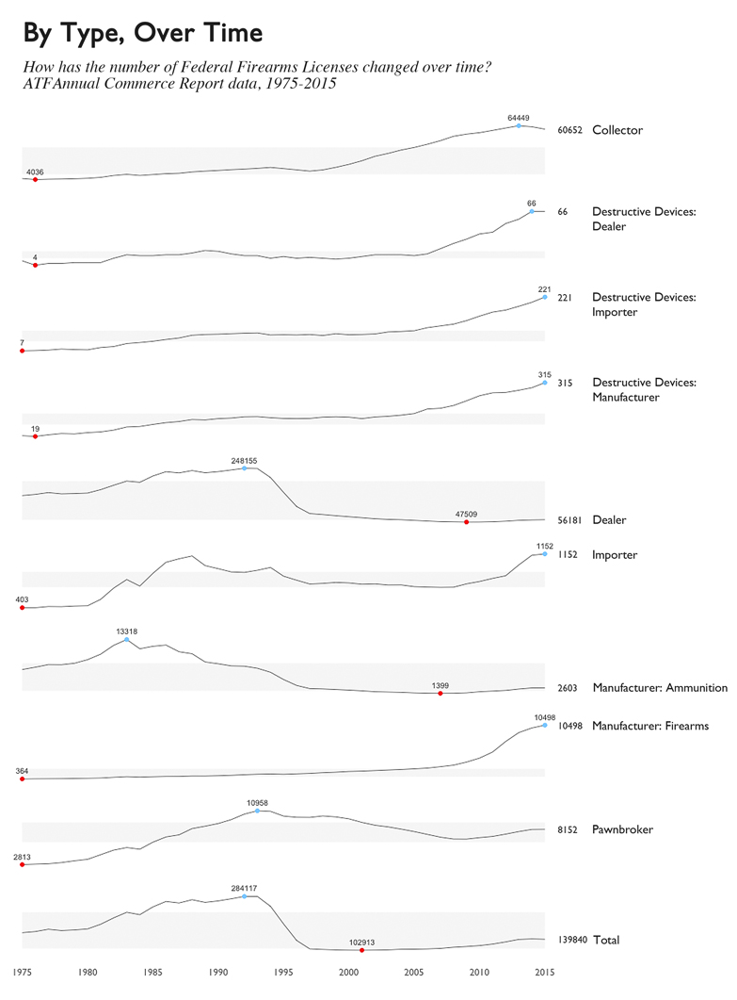

# Federal Firearms Licenses and United States Populations

### What is this project trying to do?

The **ATF** publishes data monthly on all **Federal Firearms License (FFL)** holders across the United States. This data is one facet of many in the broader culture of firearms in the US. 

This project doesn't aim to find the root causes of gun violence - rather, it seeks to understand broader characterstics of America and it's relationship to firearms. 

How do qualities of the American population look when viewed through the lens of firearms licenses? Do certain qualities conform to prevailing expectations? And are there others that might be unexpected? 

The United States Census provides estimates on different features of state populations. It covers broader aspects such as **education**, **economics**, and **race** - to more specific ones such as **fertility rates** and **types of internet subscriptions by household**. 

Comparing this to data from the ATF on Federal Firearms License holders - what trends or idiosyncracies might emerge? Where are there more firearms licenses - and what are these places like? Is the country as divided as the news makes it seem? Could capitalism - rather than democracy - be a stronger factor in the availability of firearms? 

Can developing features of the American population from data promote a a deeper understanding across different states, agendas, and ways of living?

Some of these questions are larger than the scope of any dataset. It's my hope that by examining foundational characteristics of the American population, these 'larger' questions can be approached with a fresh or mindful perspective. 

### Who is this project for?

Journalism comes to mind before start-up organizations. Ideally a not-for-profit, independent organization that values long-term investigation - be it a news source, research group, or even literary magazine. Or simply a curious and engaged discussion group - keeping things transparent and adaptable takes priority. 

United States Census data provides a decent foundation against which other characteristics of the population - beyond firearms - can be measured. 

Given that the deliverable for this project is information - it should be free to take different forms,  provided it remain true to the data. Realistically for now - it will take on the form of this GitHub repository with data, R code, and visualizations. 

### What will be analyzed, and how? 

Data on **Federal Firearms Licenses** , along with **US Census data** pertaining to fields of **_education_**, **_income_**, **_industry_**, **_legislation_**, and **_population_**. 

What characteristics of American populations by state show tendencies toward more firearms licenses, and which towards less? Can any tendencies observed be explained reasonably? After exploratory visualizations and analysis, robust regression models will be fit and regression trees will be grown - to corroborate prevailing ideas or challenge them. 

# What is a Federal Firearms License?

In the United States, a Federal Firearms License (FFL) is a requirement for those who engage in the business of firearms - generally **dealers**, **manufacturers**, and **importers**. 

It's not actually a license to carry a firearm; it's strictly for conducting business involving firearms. It's not necessary to have one if selling at gun shows, or when purchasing guns for personal reasons. 

The ATF considers 9 __types__ of FFLs: 

- Dealer
- Pawnbroker
- Collector
- Manufacturer of Ammunition
- Manufacturer of Firearms
- Dealer in Destructive Devices
- Manufacturer of Destructive Devices
- Importer of Destructive Devices

The ATF [publishes data on this FFL holders](https://www.atf.gov/firearms/listing-federal-firearms-licensees-ffls-2016) monthly, generally with the present year and two years previous. 

Additionally, an [annual commerce report](https://www.atf.gov/resource-center/data-statistics) is released, which contains numbers on weapons registrations, imports and taxes, and historical FFL data. With historical FFL data, we can broadly see how license counts have changed over time - from 1975-2015. 

## A Brief History in Numbers

Before delving into American characteristics and how they relate to Federal Firearms Licenses, a quick look at the ATF Commerce Report provides a numerical history of FFLs - something to establish our place in time. 

By the 9 Types of FFLs as defined by the ATF, how have the counts changed from 1975 to 2015[1](#works-cited)?

- Looking specifically at Destructive Devices - the number has increased steadily and heavily since 1975.
- Manufacturers of Ammunition have gone down dramatically.
- around 2010, Manufacturers of Firearms began to increase steadily.
- peak of all FFL types appears to have happened in the early 1990s.

# Notes

1 Mass shootings in the United States by year, [Wikipedia](https://en.wikipedia.org/wiki/Category:Mass_shootings_in_the_United_States_by_year). Accessed March 27th, 2017. 

2Tufte-style sparkline plot originally translated to R by [Lukasz Piwek](http://motioninsocial.com/tufte/).

n leftover  questions: How similar or different are any of these places to where I'm writing from now? 

