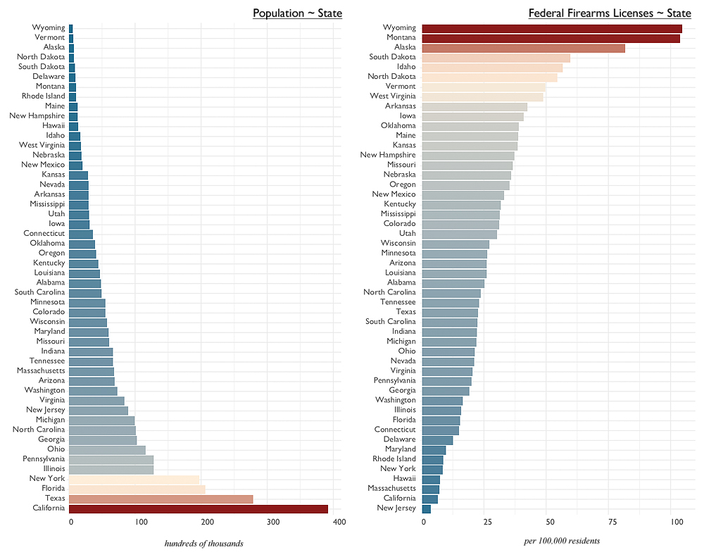
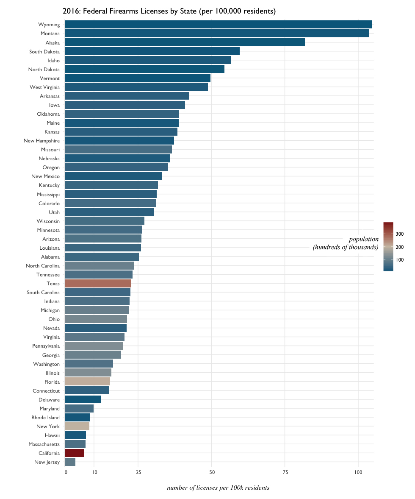

# Firearms Licenses in the United States
**Milestone Report** - Foundations of Data Science

- [The Problem](#the-problem)
- [Inversely Proportional?](#inversely-proportional)
- [Potential Approaches](#potential-approaches)
- [The Data](#the-data)
- [Notes](#notes)
- 
# The Problem

Can general characteristics on the American population provide insight relating to firearms - specifically what might contribute to the number of firearms licenses in a given state? Or conversely - by examining Federal Firearms License data, can something be learned about the American population? 

# Inversely Proportional?
#### _**Initial Discoveries in Firearms Licenses and Populations**_

Which states have the most Federal Firearms Licenses (FFLs), and which states are the most populous?

Interestingly, Wyoming tops the list for FFLs while being the least populous state. Could there be a relationship between a state's population and the number of Federal Firearms Licenses? 

Another quick bar chart might clear things up - with _per capita FFLs_ mapped to bar length, and _state population_ mapped to color fill. 

While Texas has many more total FFLs than Wyoming or Montana, when adjusted per capita the FFL-to-resident ratio appears average. 

_**Adjusting for 10,000 residents**_: There's just over 10 Federal Firearms Licenses for every 10,000 residents of Wyoming and Montana, compared to less than 2.5 for Texas. Futher, there is less than 1 Federal Firearms License per 10,000 for New York and California - the most populous states in the US. 

Could FFLs and Population really be inversely proportional?? Maybe not exactly so (i.e. _y = 1/x_ ), but rough visual inspection seems to suggest such a trend. Put bluntly: 

- more populous states --> less firearms licenses
- less populous states --> more firearms licenses

What is it about different states' populations that drives this seemingly inverse trend? Is the pattern really inverse at all? 

Can looking at different characteristics of state populations show deeper relationships? 

# Potential Approaches

- Robust Regressions - to identify outliers with calculated weights
- Robust Regressions with outliers removed
- Regression Trees
- Nonlinear regression
- Zipf Distribution fitting

# The Data

To further investigate, data was acquired from multiple sources to build a set of characteristics about the American population in relation to firearms licenses. Most relevant are data from 
-  [Bureau of Alcohol, Tobacco, and Firearms (ATF)](https://www.atf.gov/firearms/listing-federal-firearms-licensees-ffls-2016)
-  [United States Census](https://www.census.gov/acs/www/data/data-tables-and-tools/subject-tables/)
-  [National Conference of State Legislators](http://www.ncsl.org/research/about-state-legislatures/partisan-composition.aspx)

#### **What this Data CANNOT do**

- **Provide total numbers for firearms in the United States.** Why not? The data comprises Federal Firearms License holders - FFLs being a  requirement for those who engage in the _business of firearms_ - generally **dealers**, **manufacturers**, and **importers**.
- **Account for all gun owners in the US.** FFLs again are a requirement for conducting business, and additionally gun shows are generally exempt from needing an FFL to operate. 
- **Establish ground-truths** for why firearms exist in some places more than others, or any other causal conclusions. 

#### **What this Data CAN do**

- **Build a set of features of the American public in relation to firearms licenses**. These 'features' include **educational**, **economic**, **legislative**, **race**, and **workforce** characteristics by state.
- **Establish broad patterns and identify outliers in US firearm culture**. By providing an overview of firearms trends and anomolies across the states, more specific questions can be asked in regards to firearms. 
- **Provide a foundation for further exploration**, with finer grain data in any of the above mentioned fields. For example - if the relationship between _**working class industry**_ and _**firearms licenses**_ was of interest, then finer grain data than that provided by the US Census could be used to cross-compare against firearms data provided by the ATF. 
- Again, because of exceptions in certain laws, and the existence of black market trade - only those with Federal Firearms Licenses will be considered. FFLs, in this case, can be considered a certain 'metric' for what the United States concensus on what is 'permissible' in firearms culture.

## United States Census

Data from the [US Census](https://www.census.gov/acs/www/data/data-tables-and-tools/subject-tables/) were acquired[1](#Notes), on different the total population and different attributes of America. 

- _"National Population Totals Datasets: 2010-2016"_, [US Census](https://www.census.gov/data/datasets/2016/demo/popest/nation-total.html).
- _"2010 Census Urban and Rural Classification and Urban Area Criteria"_, [US Census](https://www.census.gov/geo/reference/ua/urban-rural-2010.html).

National population totals were acquired to merge with ATF firearms license data - to begin answering basic 

- _"Educational Attainment"_, [US Census - American Community Survey](https://www.census.gov/acs/www/data/data-tables-and-tools/subject-tables/), table S1501.
- _"Finanacial Characteristics"_, [US Census - American Community Survey](https://www.census.gov/acs/www/data/data-tables-and-tools/subject-tables/), table S2503.
- _"Industry by Class of Worker for the Civilian Employed Population 16 Years and Over"_, [US Census - American Community Survey](https://www.census.gov/acs/www/data/data-tables-and-tools/subject-tables/), table S2407.

US Census data on education, finance, and industry were downloaded as CSVs from the Census site, and required a large amount of filtering and cleansing. For example:

-  _Educational Attainment_ data came with 53 observations of 771 variables
-  _Financial Characteristics_ comprised 53 observations of 279 variables

These datasets were filtered down to select variables so that they could used for model building.  Beyond total population estimates per category, most of the variables were Census-provided derivations of the totals, e.g. percentages. 

## National Conference of State Legislators

State legislator data was acquired from the National Conference of State Legislators, and came in the form of PDF files with tables; these were imported into [Tabula](http://tabula.technology/) to be processed into CSV to read into R. 

 - _"Legislator Data - State Partisan Composition"_, [NCSL](http://www.ncsl.org/research/about-state-legislatures/partisan-composition.aspx), [2014 data](http://www.ncsl.org/documents/statevote/legiscontrol_2014.pdf)

This data comprised numerical fields by state, providing totals for State (not Federal) governing bodies. Of particular interest:

- Senate Democrats
- Senate Republicans
- House Democrats
- House Republicans
- Legislative Control by Party
- Governing Control by Party
- State Control by Party

**Legislative Control** refers to the majority party in State Senate and State House, and **Governing Control** refers to party of the governorship. 

**State Control** is determined by the parties in control of Legislative and Governing branches.

## ATF Federal Firearms Licenses

Finally, [Federal Firearms License](https://www.atf.gov/firearms/listing-federal-firearms-licensees-ffls-2016) data[1](#Notes) is available monthly from the ATF website, in .xlsx or .txt files. I'd downloaded all .xlsx files available, and grouped them into different folders by year. 

CSVs with annual FFL totals were created by:
 - creating a list of .xlsx files corresponding to directory by year
 - initializing a dataframe
 - using a `for` loop to read in each .xlsx file
 - adding the month and year as variables
 - binding each monthly .xlsx into a single dataframe

This data comprised many fields, such as business name, license holder name, full addresses for mailing and premise, phone number. While interesting to have, what became most important was to calculate monthly total FFLs by state, and from there derive monthy per capita (100,000) FFL counts by state.

 # Notes
 
 1  names and sources for all datasets: 
 
 - _"Listing of Federal Firearms Licensees (FFLs) - 2016"_, [Bureau of Alcohol, Tobacco, and Firearms (ATF)](https://www.atf.gov/firearms/listing-federal-firearms-licensees-ffls-2016), complete listings by month and year.
 - _"Educational Attainment"_, [US Census - American Community Survery](https://www.census.gov/acs/www/data/data-tables-and-tools/subject-tables/), table S1501.
 - _"Finanacial Characteristics"_, [US Census - American Community Survery](https://www.census.gov/acs/www/data/data-tables-and-tools/subject-tables/)table S2503.
 - _"Industry by Class of Worker for the Civilian Employed Population 16 Years and Over"_, [US Census - American Community Survery](https://www.census.gov/acs/www/data/data-tables-and-tools/subject-tables/), table S2407.
 - _"National Population Totals Datasets: 2010-2016"_, [US Census](https://www.census.gov/data/datasets/2016/demo/popest/nation-total.html)
 - _"2010 Census Urban and Rural Classification and Urban Area Criteria"_, [US Census](https://www.census.gov/geo/reference/ua/urban-rural-2010.html)
 - _"Legislator Data - State Partisan Composition"_, [NCSL](http://www.ncsl.org/research/about-state-legislatures/partisan-composition.aspx), [2014 data](http://www.ncsl.org/documents/statevote/legiscontrol_2014.pdf)

