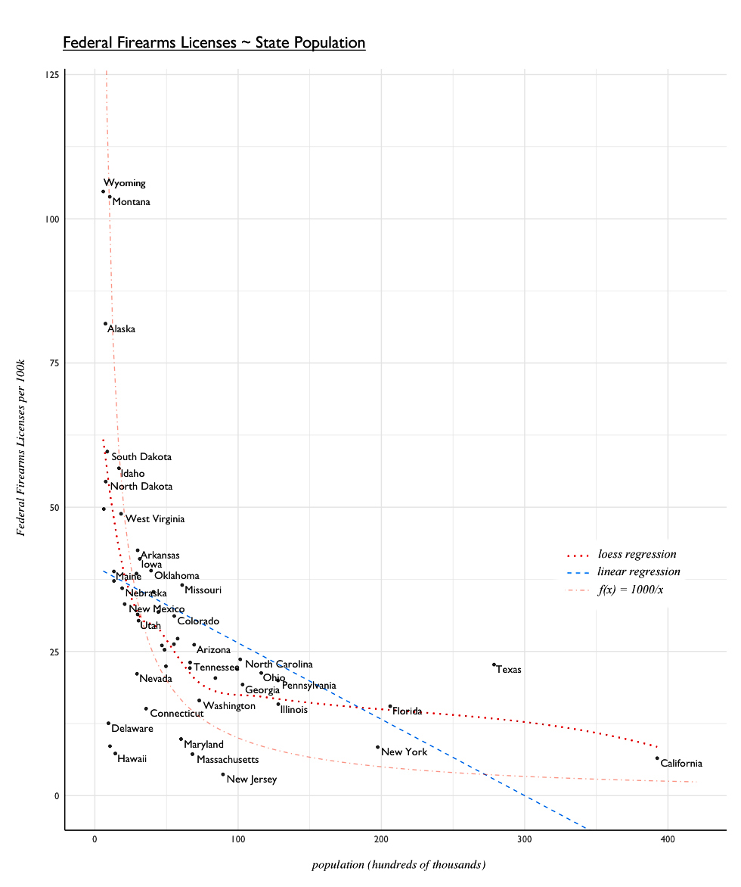

# Fundamental Firearms Factors

- [Project Proposal](00-project-proposal.md)
- [Milestone Report](01-milestone-report.md)
- [What is a Federal Firearms License?](#what-is-a-federal-firearms-license)
- [Notes](#notes)

## What is this project trying to do?

What does the number of Federal Firearms Licenses in a given state say about that state? About the United States as a whole? 

Can data provided by the ATF on Federal Firearms License holders - when compared to various datasets from the **US Census**, **American Community Survey**, and **Energy Information Administration** - provide insight into the nature of American populations?

# What is a Federal Firearms License?

In the United States, a Federal Firearms License (FFL) is a requirement for those who engage in the business of firearms - generally **dealers**, **manufacturers**, and **importers**. 

It's not actually a license to carry a firearm; it's strictly for conducting business involving firearms.

The ATF considers 9 __types__ of FFLs: 

- Dealer
- Pawnbroker
- Collector
- Manufacturer of Ammunition
- Manufacturer of Firearms
- Dealer in Destructive Devices
- Manufacturer of Destructive Devices
- Importer of Destructive Devices

This [data](https://www.atf.gov/firearms/listing-federal-firearms-licensees-ffls-2016) is published monthly. How have the counts changed from 1975 to 2015[2](#works-cited)?

# Notes
1 _"Firearms Commerce Report in the United States"_, [atf.gov](https://www.atf.gov/resource-center/data-statistics).

2Tufte-style sparkline plot originally translated to R by [Lukasz Piwek](http://motioninsocial.com/tufte/).

3 It's not necessary to have one if selling at gun shows, or when purchasing guns for personal reasons. 

