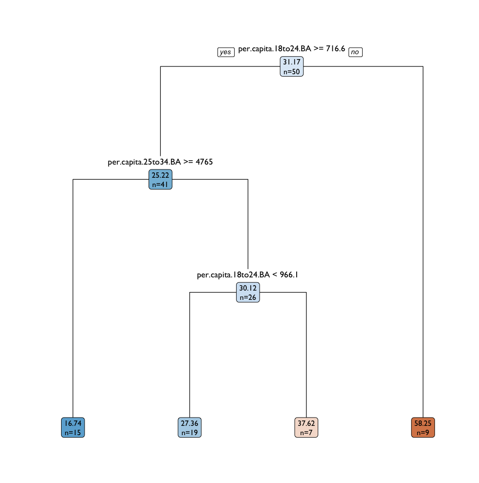
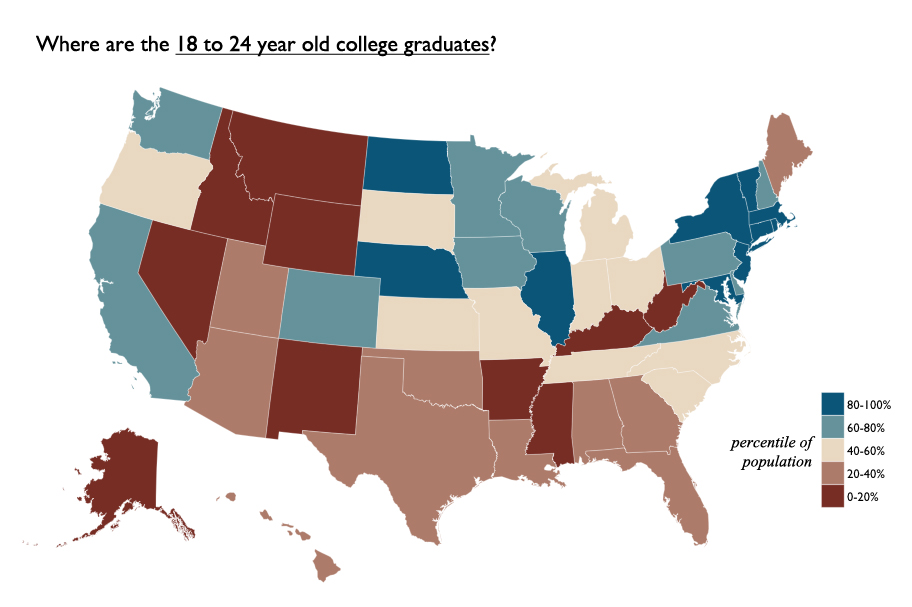
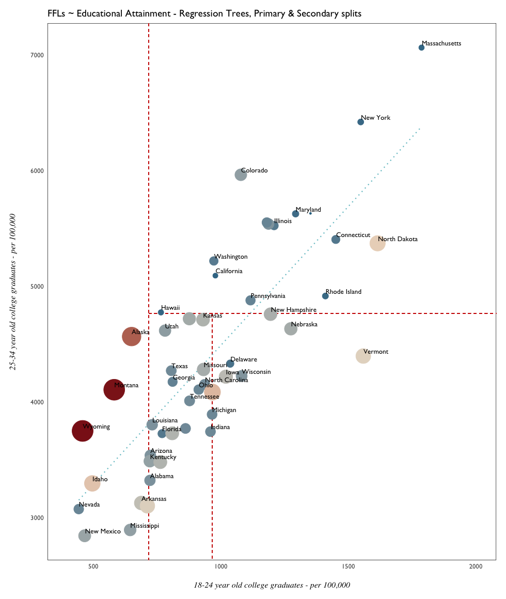

# Significant Regression Tree Outputs

# Educational Attainment

Regression trees were grown on Educational Attainment data - per capita High School and College graduate figures by state. 



```{R}
summary(edu.rpart02)
...
Variable importance
per.capita.18to24.BA 35
per.capita.25to34.BA 26
per.capita.35to44.BA 17
per.capita.45to64.BA 14
per.capita.25to34.HS 4
per.capita.35to44.HS 3
per.capita.45to64.HS 1
```

Regardless of age group, college graduate levels had more explanatory power than high school graduate levels according to the `rpart` regression tree model. Particularly important were young college graduates in the 18-24 year old age group - less than 716 led to a grouping of states with the highest average FFL overall. 



A map of 18-24 year old college graduates by state was produced after discretizing the age variables into 20%  quantiles. The 20th percentile actually was a good approximation of the initial regression tree split, at approximately ~720 graduates per capita. Essentially, the reddest states on the map should correspond to the highest average FFL count overall 58.25.  

```{R}
# discretize population into 20% quantiles
ba.q <- quantile(edu$per.capita.18to24.BA,
                 seq(0, 1, 0.2))

ba.q
#       0%       20%       40%       60%       80%      100% 
# 442.5129  721.6580  840.9432  968.9943 1197.4317 1787.0535 
```

A scatterplot of the decision tree splits could confirm this. 



The general trend suggested by the model is:

- more young college graduates --> less firearms licenses 

 A couple of outliers in this model show up: North Dakota and Vermont, both boasting high numbers of young college graduates and firearms licenses. 
 
 # Educational Outliers
 
 TODO: Robust Regression to find weights assigned to outliers.