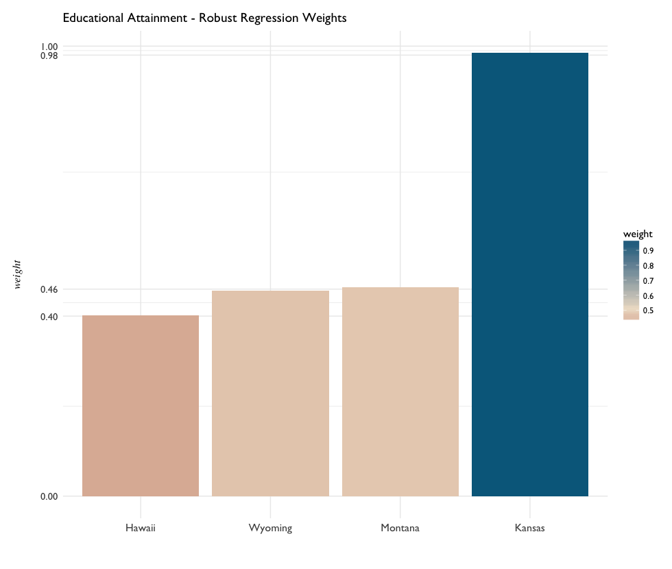
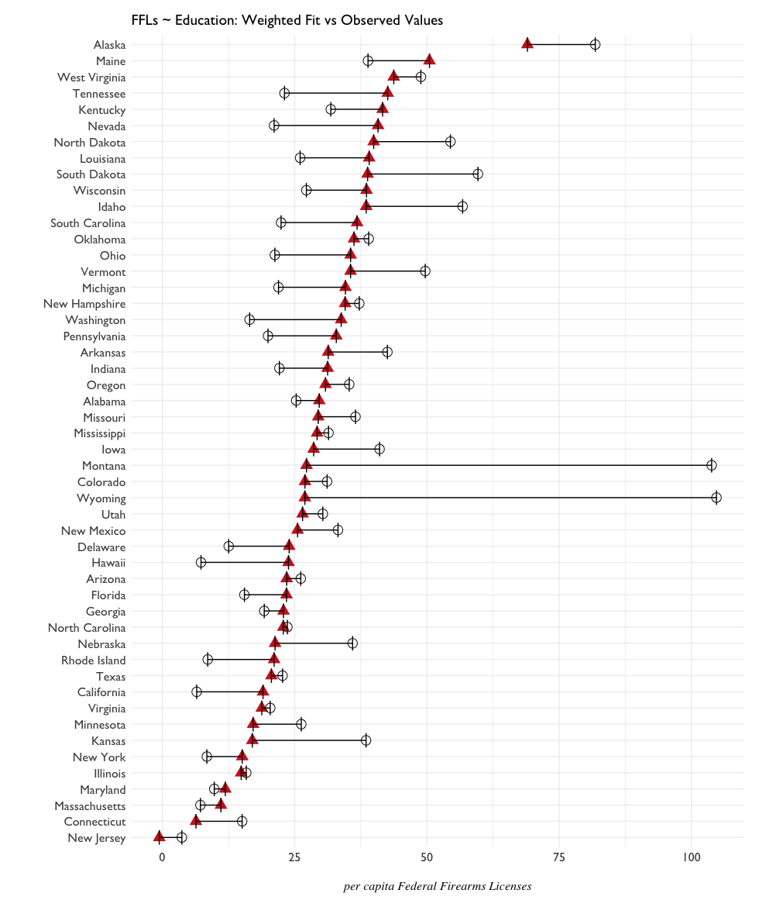

# Higher Education, Less Firearms 

Generally, the more young college graduates per state, the less Federal Firearms licenses. _What's being taught?_ _What isn't being taught?_

# Educational Attainment

Regression trees were grown on Educational Attainment data<sup>[1](#notes) </sup> - per capita High School and College graduate figures by state. High School and College Graduate figures were further broken into five age groups, for ten variables total:

- 18 to 24 HS, 18 to 24 BA
- 25 to 34 HS, 25 to 34 BA
- 35 to 44 HS, 35 to 44 BA
- 45 to 64 HS, 45 to 64 BA
- 65 and older HS, 65 and older BA


```{R}
summary(edu.rpart02)
...
Variable importance
per.capita.18to24.BA 35
per.capita.25to34.BA 26
per.capita.35to44.BA 17
per.capita.45to64.BA 14
per.capita.25to34.HS 4
per.capita.35to44.HS 3
per.capita.45to64.HS 1
```

Regardless of age group, college graduate levels had more explanatory power than high school graduate levels according to the `rpart` regression tree model. Particularly important were young college graduates in the 18-24 year old age group - less than 716 led to a grouping of states with the highest average FFL overall. 

While the `rpart` tree suggests the importance of college graduates as an explanatory variable, the range of figures for high school graduate data across all age groups was significantly narrower than that of college graduates. Across all states, high school graduation levels didn't vary tremendously. 

Educational attainment beyond the age of 65 didn't play a significant role in this model. 


A map of 18-24 year old college graduates by state was produced after discretizing the age variables into 20%  quantiles. The 20th percentile actually was a good approximation of the initial regression tree split, at approximately ~720 graduates per capita. 

Essentially, the reddest states on the map should correspond to the highest average FFL count overall 58.25.  

```{R}
# discretize population into 20% quantiles
ba.q <- quantile(edu$per.capita.18to24.BA,
                 seq(0, 1, 0.2))
                 
ba.q
#       0%       20%       40%       60%       80%      100% 
# 442.5129  721.6580  840.9432  968.9943 1197.4317 1787.0535 
```

A scatterplot of the decision tree splits could confirm this. 


The general trend suggested by the model is:

- more young college graduates --> less firearms licenses 

 A couple of outliers in this model show up: North Dakota and Vermont, both boasting high numbers of young college graduates and firearms licenses. 
 
 # Outliers in Education
 
Robust Regression model

Weights were assigned to Hawaii, Wyoming, Montana - and very slightly so to Kansas. 



 _weighted fit value in red_
 
 # Notes
 
 <sup>1</sup> Educational Attaintment, [2015 American Community Survey 1-year estimates](https://www.census.gov/acs/www/data/data-tables-and-tools/subject-tables/), table S1501.