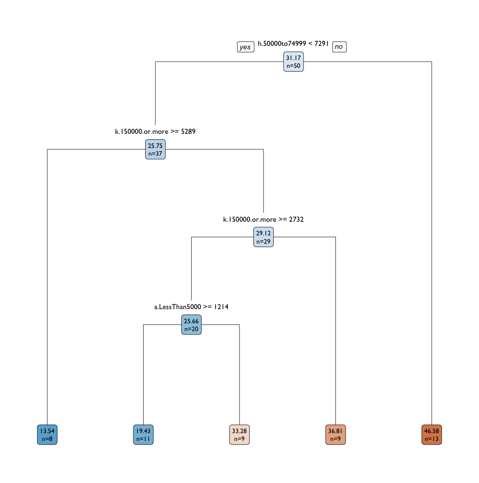
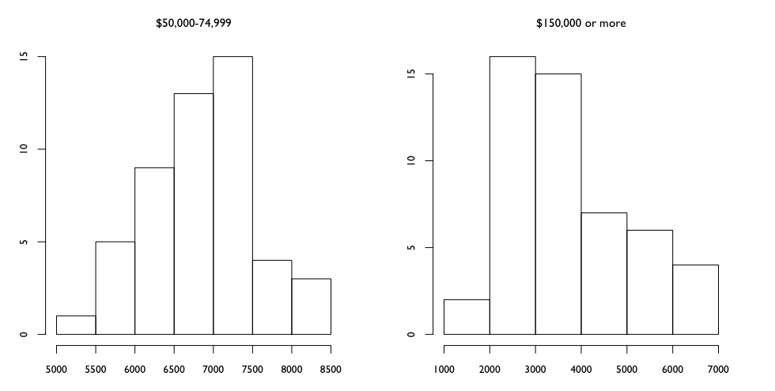

# Financial Characteristics

How does annual household income relate - if at all - to Federal Firearms License counts? Are there any trends among different income groups? Does more money lead to less firearms licenses? Does less money lead to more? 

- [Annual Household Incomes](#annual-household-incomes)
- [Trending Directions](#trending-directions)
- [Extremes of Poverty and Wealth](#extremes-of-poverty-and-wealth)
- [Upward Trends Toward Center](#upward-trends-toward-center)
- [Seemingly No Effect](#seemingly-no-effect)
- [Regression Trees](#regression-trees-on-income)
- [Income Outliers](#income-outliers)
- [Potential Future Directions](#potential-future-directions)

# Annual Household Incomes
"Financial Characteristics" data from the United States Census comprises population totals categorized into 11 brackets based on annual household income. 

There are five stratifications at or beneath the Census-defined poverty threshold of $24,257 in annual income for a household of four<sup>[1](#notes)</sup>. The remaining categories can be argued as middle-class, with the highest reported income bracket at $150,000 and over. 

The categories as defined by the census:

- Less than $5,000
- $5,000 to $9,999
- $10,000 to $14,999
- $15,000 to $19,999
- $20,000 to $24,999
- $25,000 to $34,999
- $35,000 to $49,999
- $50,000 to $74,999
- $75,000 to $99,999
- $100,000 to $150,000
- $150,000 or more

# Trending Directions

A quick faceted scatterplot with `geom_smooth` for a _general_ sense of any potential trends relating firearms licenses and annual income. 


- A downward FFL trend is noted only at the extremes of poverty and wealth - **Less than $5,000** and **$150,000 or more**. 
- Each other bracket shows upward trending with firearms licenses - with the trend appearing most firm towards the central income brackets (**$35,000-49,999** and **$50,000-$74,999**). Outwards in either direction from this 'center' the positive slope becomes questionably weak, until reversing at the extremes.
- At just above six-figures annually, there appears to be zero relationship  - zero slope.
 
# Extremes of Poverty and Wealth

At the two extremes of the income categories, a downward trend with FFLs is observed. A thought that comes to mind is, more of those in poverty will be where there are more people - urbanized areas. It's been observed in Rural-Urban proportions data that Urbanized Areas have a tendency towards less firearms licenses.

Is it possible that income in these cases is approximately normally distibuted, making it so population rather income is what's driving the FFL trend?

As usual, the three high FFL outliers **Alaska**,** Montana**, and **Wyoming** stand out. 


# Upward Trends Towards Center


Heartland, Middle America, Midwest, Flyover Country, Bible Belt, Rust Belt, Red States, Swing States


Generally it appeared that towards the approximate _center_ income categories, there would be an upward trend in FFLs. 


Rough visual inspection of the scatterplots suggests that the strongest trends might be in the $35-$50k and $50-75k annual income brackets.

# Seemingly No Effect

At incomes of $5,000-$9,999 and $100,000-$149,000 annually, there appears to be no relationship between income and FFLs. The degree of scatter in the $100,00-$149,999 category is quite high. 


# Regression Trees

## first `rpart` tree 



There's significant different in variable choices and splits between the `rpart` and `tree` models. The tree grown by `rpart` above seems to suggest a smaller middle class paired with a large upper class tends towards the least amount of FFLs - but with 8 states exhibiting such criteria, they'd have to be considered outliers in this case. 


How were the split criterion variables for the `rpart` model distributed? 



## first`tree` tree

Interestingly, the tree grown with `tree` decides initially using an annual income of less than $5,000 - if per capita this population is less than 860 - the more FFLs there are on average. Could this mean that lower rates of poverty in a given state associate with higher per capita FFLs? 

The smallest lower middle class (annual household income between $35-50k) is the next most important explanatory variable in this tree. As this class decreases, so does the average FFL count. 


Pruning the `tree` model only seems to confirm this lower-middle-class trend.


And how were the split variables for the `tree` model distributed? 


# Income Outliers

How to the outliers in a moel using annual income brackets behave? A robust regression model will be fit, and weights assigned to perceived outliers will be calculated.

```{R}
library(MASS)

# fit robust model
rr01 <- rlm(perCapitaFFL ~ ., data = income)
rr01

# check weights
rr01.weights <- data.frame(NAME = rownames(income),
                           resid = rr01$resid,
                           weight = rr01$w) %>% arrange(weight)

rr01.weights[1:20, ]
#            NAME       resid    weight
# 1       Montana  57.9554955 0.1677059
# 2        Alaska  41.9383192 0.2317737
# 3  South Dakota  26.6815671 0.3642432
# 4       Wyoming  22.6616821 0.4289978
# 5     Wisconsin -19.1916066 0.5064435
# 6   Connecticut  15.3404753 0.6335840
# 7      Nebraska -14.7089436 0.6607560
# 8        Hawaii -14.2276126 0.6830256
# 9       Indiana -11.7004541 0.8306417
# 10    Minnesota -10.8116808 0.8989420
# 11      Arizona  10.2466120 0.9485886
# 12      Alabama   2.1419139 1.0000000
```


Weighted Fit Values vs. Observed, weighted fit in red.


Montana, Alaska, South Dakota, and Wyoming are heavily penalized by the robust regression model. 

# Potential Future Directions

- Bureau of Labor Statistics

# Notes

<sup>1</sup> "Poverty Thresholds", [United States Census](https://www.census.gov/data/tables/time-series/demo/income-poverty/historical-poverty-thresholds.html).