# Workforce Populations by Industry

"**_INDUSTRY BY SEX FOR THE FULL-TIME, YEAR-ROUND, CIVILIAN EMPLOYED POPULATION 16 YEARS AND OVER_**"

The dataset from the US Census provides a range of different population totals by workforce sector, or industry<sup>[1](#notes)</sup>. There are 20 total sectors that the Census measures across states. Population totals by industry provided were transformed into per capita figures (100,000), to scale with the Federal Firearms License data in addition to the US population in general.  

How does each industry interact with the number of Federal Firearms Licenses in a given state, if at all? 

# The Industries

- Agriculture, forestry, fishing and hunting
- Mining, quarrying, and oil and gas extraction	
- Construction
- Manufacturing
- Wholesale Trade
- Retail Trade
- Transportation and Warehousing
- Utilities
- Information
- Finance and insurance
- Real estate and rental and leasing
- Professional, scientific, and technical services
- Management of companies and enterprises
- Administrative and support and waste management services
- Educational services
- Health care and social assistance
- Arts, entertainment, and recreation
- Accommodation and food services
- Other services, except public administration
- Public administration

# What's Trending in Industry? 
 
 Faceted scatterplots were created to get a broad sense of how the variables related to per capita Federal Firearms License numbers across the states. Rough linear and loess approximations were fit using `geom_smooth` from `ggplot2`.
 
 ## Firearm-Friendly Industries
 
 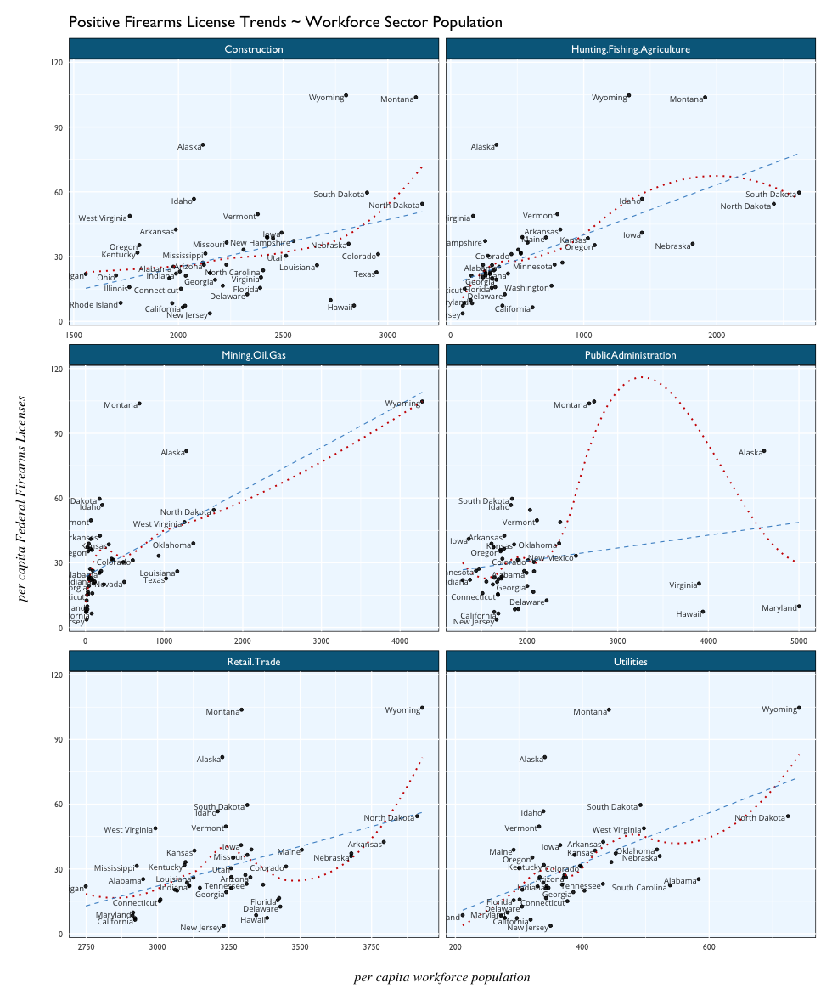
 
 Industries showing a potential upward trend in relation to firearms licenses: 
 
 - Construction
 - Hunting & Fishing, Agriculture, Forestry
 - Mining, Oil & Gas Extraction
 - Public Administration
 - Retail Trade
 - Utilities

**Hunting & Fishing** was to be expected - but **Retail Trade** and **Utilities** raised questions. **Public Administration** appears to have too much scatter among the outliers to fully trust the lm/loess lines. Appearing regularly as outliers (again) are Wyoming, Montana, and Alaska. 

## Wyoming Coal Country
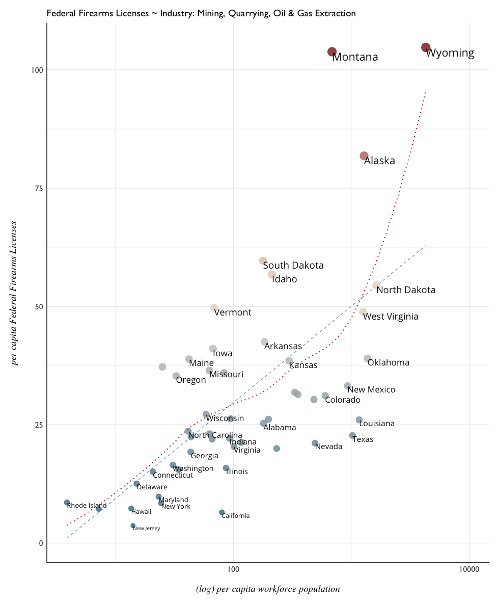

Wyoming leads the country in coal production - which heavily involves the use of explosives which are classified as `Destructive Devices` under ATF-FFL regulation. Looking at industry, we may have a significant explanation for Wyoming's outsize Federal Firearms License count. 

## Why Utilities? 

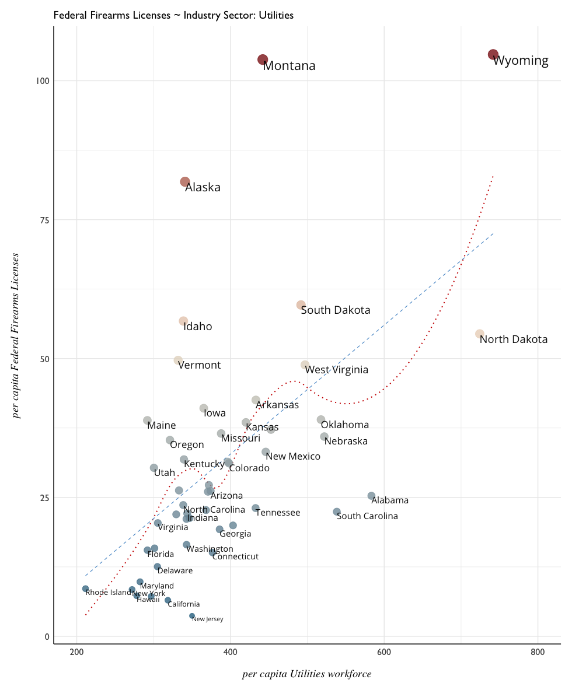

## How strong is the trend in Construction?

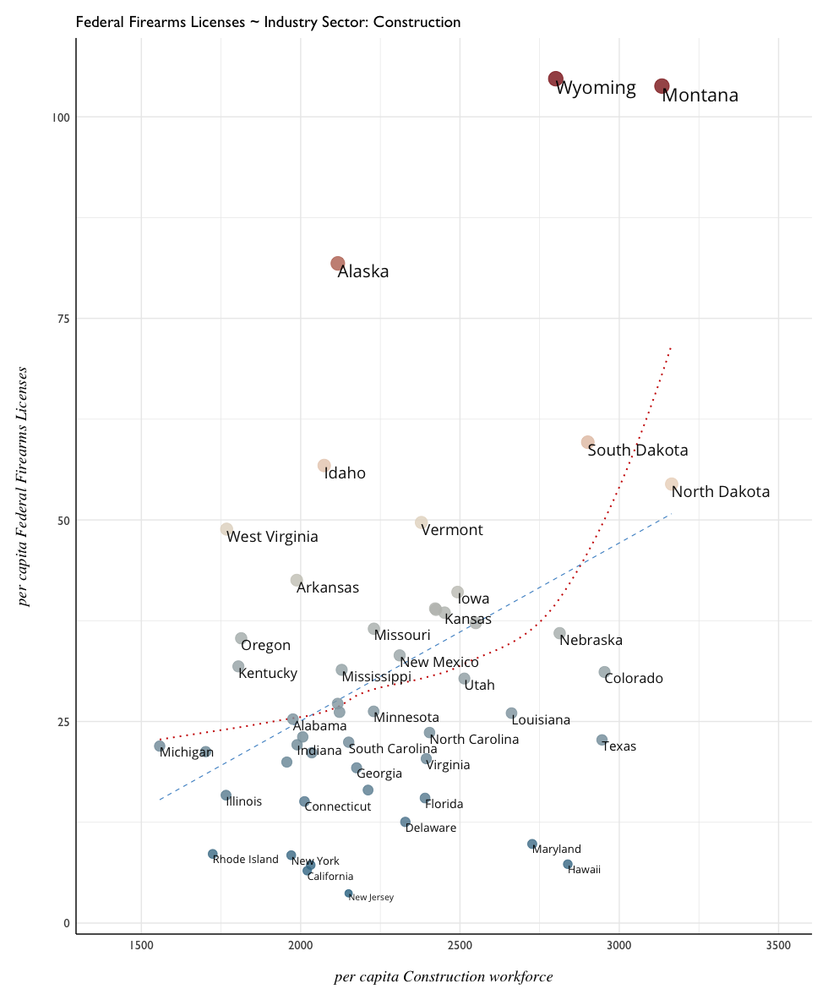

The linear and loess regression lines suggest a positive trend, but the scatter of the data suggests the outlier states **Alaska**, **Montana**, and **Wyoming** are exerting undue influence.  

 ### No Need for Firearms Licenses
 
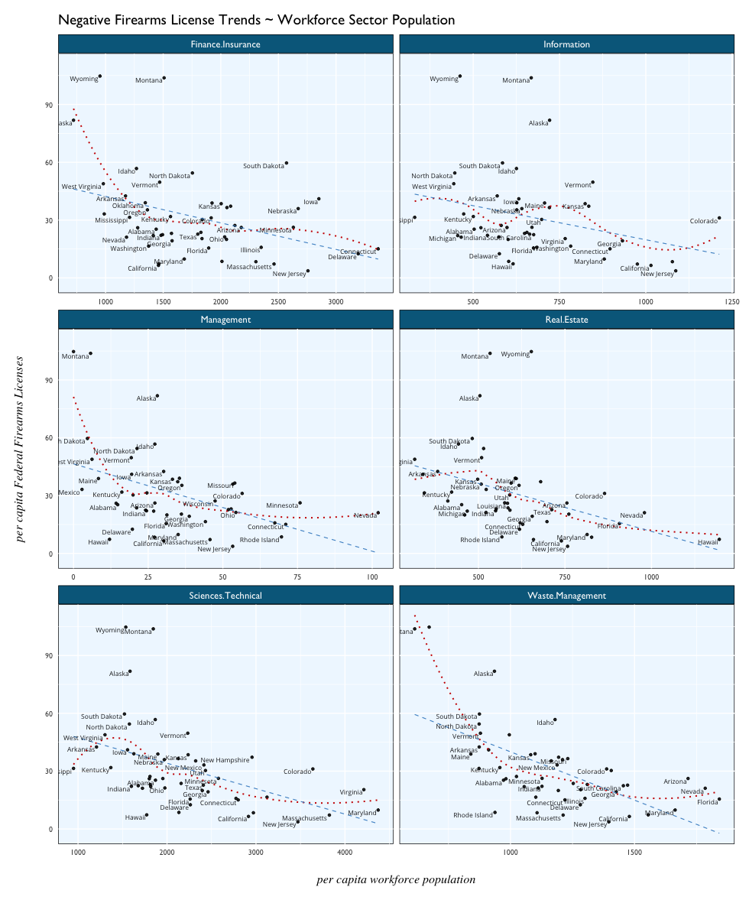

 Industries showing a potential downward trend in relation to firearms licenses: 
 
- Finance & Insurance
- Information
- Management
- Real Estate
- Sciences & Technical Professionals
- Waste Management

One might expect **Sciences** and **Finance** to have correlate negatively with firearms licenses.

**Waste Management** looks interesting in that a negative trend appears firm. A glance shows states that hedge rural with low workforces in waste management - could it be there is less waste created? 

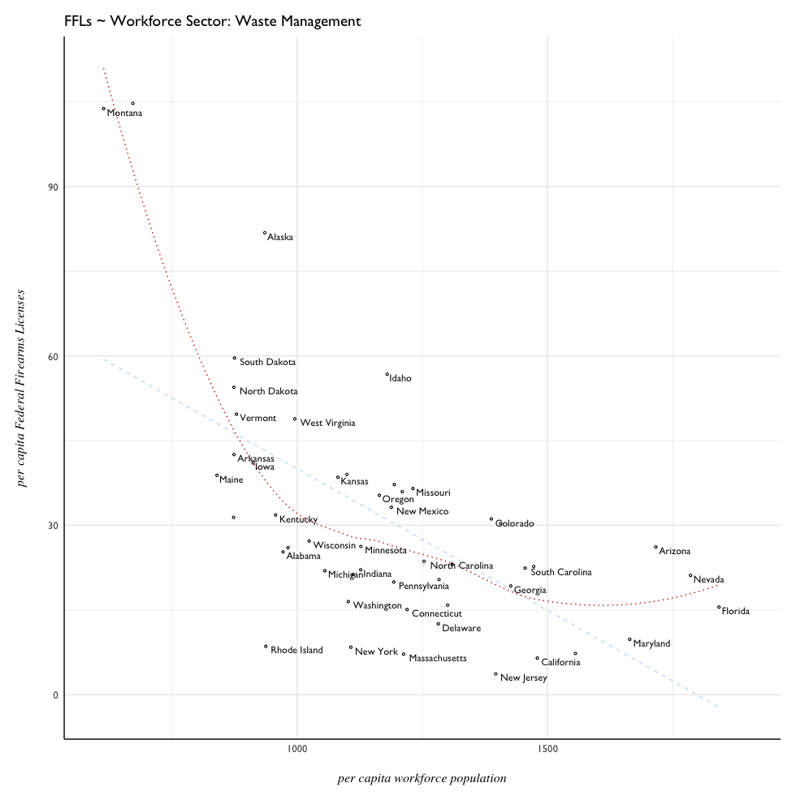

### Take it or leave it

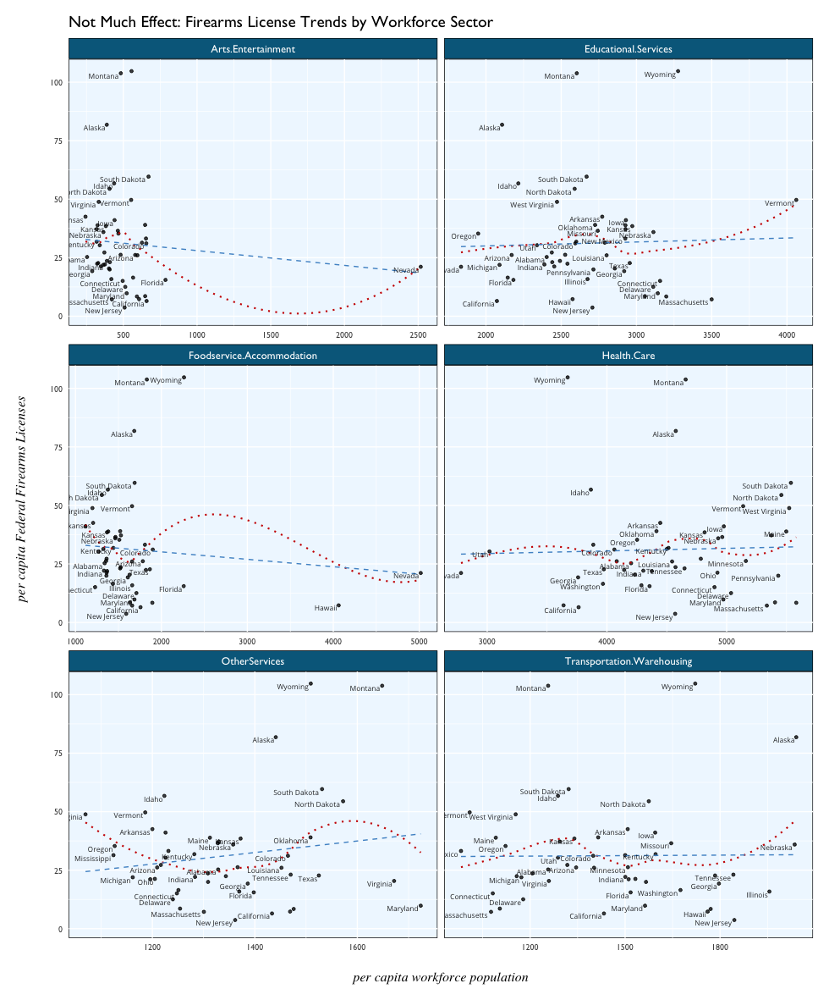

Industries not showing much in terms of Firearms License trends:

- Arts & Entertainment
- Educational Services
- Foodservice and Accomodation
- Health Care
- Transportation & Warehousing

The **Transportation & Warehousing** industry appears particularly ambivalent in regard to firearms licenses. Perhaps it is the most "well-rounded" industry in the United States, with states both rural and urban appearing at different scales across the graph.

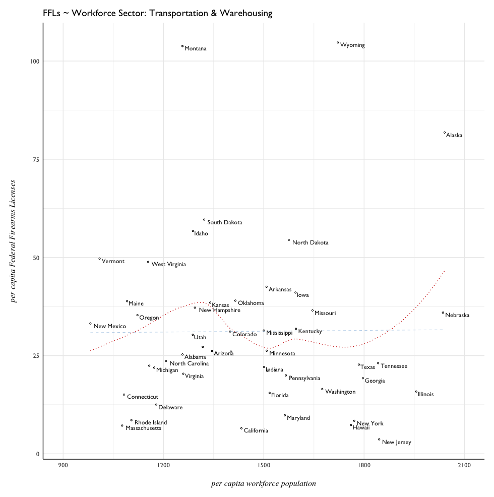

# Regression Trees on Industry Data

- Regression Trees on Workforce-Industry population data. 
- 50 observations of 22 variables
- All variables per 100,000 residents

While not the largest dataset in terms of variables - regression trees were grown nonetheless after exploratory visualizations. This was to hopefully get a better sense of the data structure, identify possible interactions between variables, and develop a deeper sense of the variation in Firearms Licenses across different states. 

### the `rpart` model

Using `rpart` to grow regression trees on this dataset, interesting splits and criteria are observed per workforce sector/industry. 

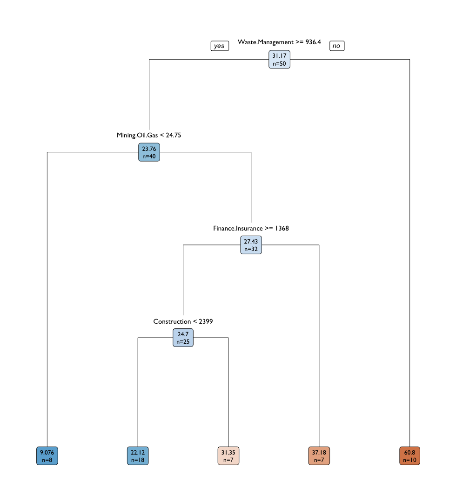

Out of the four variables chosen for splits, two showed a positive trend in relation to FFLs:

- `Mining, Oil, and Gas Extraction`
- `Construction` 

While the other two variables corresponded to a negative trend with FFLs:

- `Finance and Insurance`
- `Waste Mangaement`

### Who Needs Waste Management? 
**Waste Management** is the key variable/workforce sector in this case, and initially showed a downward trend in regard to FFLs.  There are 10 states where there are less than 936 Waste Management workers per 100,000 residents. These states produce the largest average FFL count - nearly 61 - just about double the mean before the initial split.

### Where is the Earth Mined? 
**Mining, Oil and Gas extraction** comprises the second split - and has what appears to be a very low value for split criteria (_N_ < 24.75, far lower than the 1st quantile). This is because of the outsize presence in Mining, Oil & Gas that **_Wyoming_** and **_North Dakota_** have. 

### Less Finance, More Firearms
Away from the FFL extremes, split criteria based on

- **Finance & Insurance** (_n_ >= 1368)
- **Construction** (_n_ < 2399) 

determine the variation in firearms licenses amongst the more central population. Generally speaking:

- larger Finance & Insurance workforce --->  **_Slightly less_** FFLs, on average.
- smaller Finance & Insurance workforce ---> **_Many more_** FFLs, on average.

The average drops by nearly 3 when the Finance workforce is greater than 1,368 per 100,000 residents in a given state. But in states where the Finance workforce is smaller than that, the mean FFL goes up to 37.2 - increasing the average by 9.8 firearms licenses. 

The effect is much more pronounced with a smaller **Finance & Insurance** workforce than with a larger one. 

### Growing Together: Construction
A similar - but inverted - trend is noted with the Construction workforce. Firearms Licenses and the **Construction** workforce tend to grow or shrink in number _together_:

- smaller Construction workforce ---> **_Slightly less_** FFLs, on average.
- larger Construction workforce --->  **_Many more_** FFLs, on average.

The average drops from to 24.7 to 22.1 when the Constuction industry is less than 2399 per 100k in a given state. 

Conversely - the FFL average rises by 6.7 units in states where Construction workers are greater than 2,399 per capita. The effect of being "over the threshold" in **Construction** is stronger than being under it. 

Relative to the splits generated, most states (n = 18) fall into a grouping with mean FFL of 22.1. This corresponds to a mixture of splits amongst the 4 workforce sectors used in variable partitioning.

### the  `tree` model

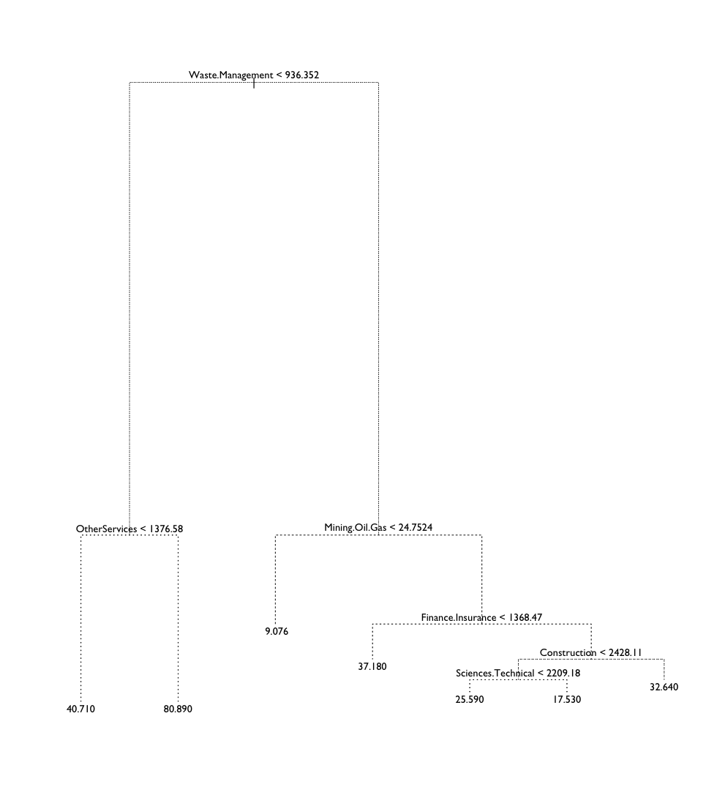

A regression tree grown using `tree` corroborates the importance of the **Waste Management** workforce sector. The secondary split is now divided between **Other Services** and **Mining, Oil & Gas**. 

Given the high mean value of 81 FFLs in the split at **Other Services**, it might be safe to assume that Wyoming, Montana, and/or Alaska have low **Waste Management** per capita coupled with a higher **Other Services** population per capita. 

## Split Criteria Visualized

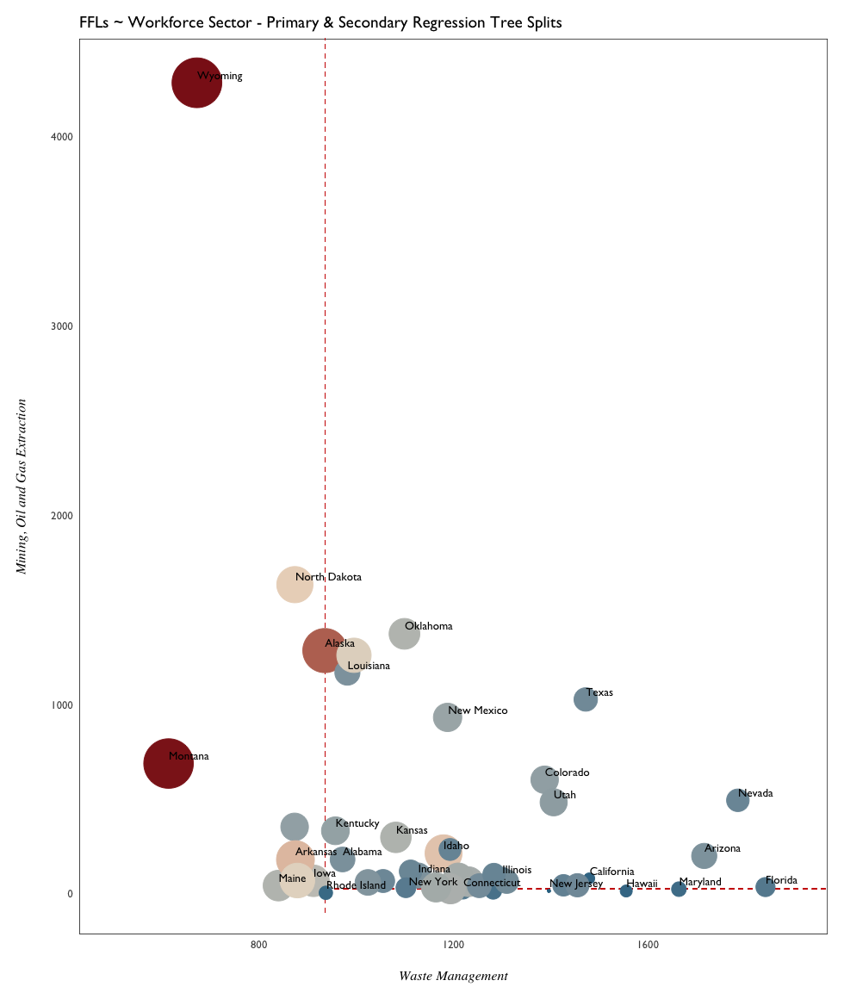

Wyoming appears to be exerting an undue influence on this split with its **Mining, Oil & Gas** population - more than twice that of North Dakota, the next state in rank. The split drawn at Mining, Oil & Gas (24.75) is well below the _1st quantile, median, and mean values_ for that distribution.

```{R}
summary(wf$Mining.Oil.Gas)
#     Min.  1st Qu.   Median     Mean  3rd Qu.     Max. 
#    3.884   41.610   89.730  376.700  346.900 4282.000 
```

But with Wyoming removed, this distribution should change dramatically:

```{R}
wf.wy <- wf %>%
  filter(NAME != "Wyoming")

summary(wf.wy$Mining.Oil.Gas)
#     Min.  1st Qu.   Median     Mean  3rd Qu.     Max. 
#    3.884   41.460   86.700  297.000  331.500 1632.000
```

Dramatically, but perhaps not dramatically enough thanks to North Dakota's presence in **Mining, Oil & Gas**.

# Robust Regression - Workforce Features and Outliers

A robust regression model will be fit to look at the influence of outliers - first using the 4 split criteria variables from the regression tree model (plus one extra, **Information**, as a potential nuisance variable)

```{R}
library(MASS)
wf.rr01 <- rlm(perCapitaFFL ~ Waste.Management + Mining.Oil.Gas + 
                 Finance.Insurance + Construction + Information, data = wf)
```

And checking the weights assigned to influential outliers: 

```{R}
# check weights
rr01.weights <- data.frame(NAME = rownames(wf),
                           resid = wf.rr01$resid,
                           weight = wf.rr01$w) %>% arrange(weight)
```

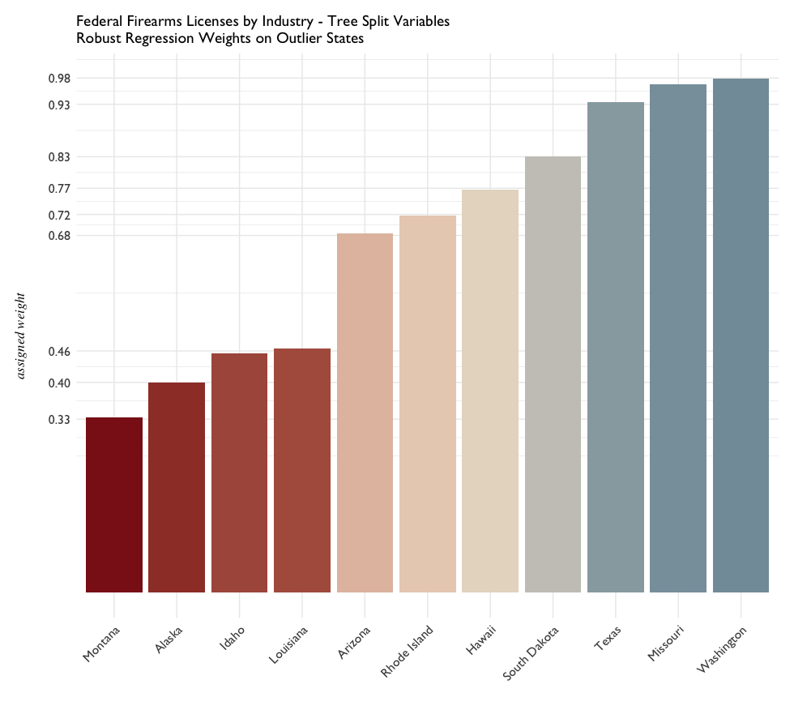

Then to merge weights with fitted and create weighted fit values for comparison:

```{R}
rr01.coef <- augment(wf.rr01) %>%
  mutate(NAME = rownames(wf)) %>%
  left_join(rr01.weights) %>%
  mutate(weighted.resid = .resid * weight,
         weighted.fit = .fitted * weight) %>%
  arrange(weight)
```

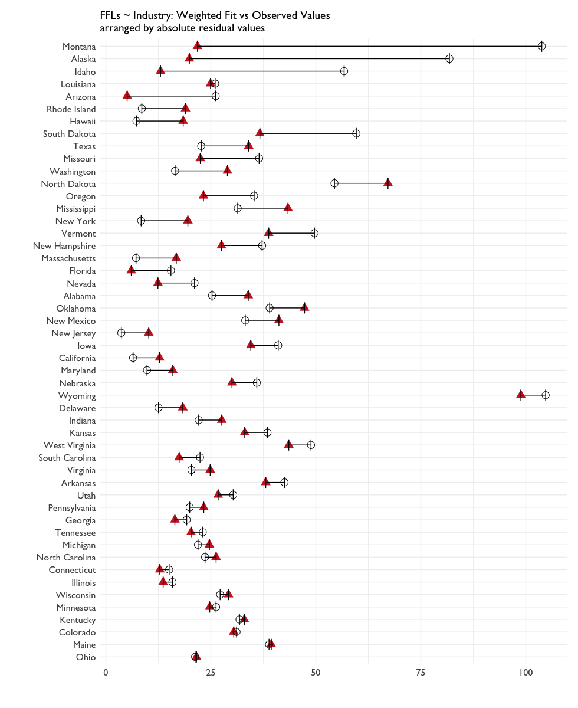

Interestingly - the Huber method used in the robust regression didn't alter weighting for Wyoming, which had the largest **Mining, Oil & Gas** workforce across the US by a large margin. **Montana**, **Alaska**, and **Idaho** were heavily penalized by this model. Why is this<sup>[1](#appendix)</sup>? 

# Robust Model 02

A second robust regression was fit - using all variables save Civilian Population - to see if the model would address any of Wyoming's unique traits in it's weighting system. Maximum iterations was raised to 40 for the model to converge. 15 observations received a weighting in this model utilizing (nearly) all variables. 

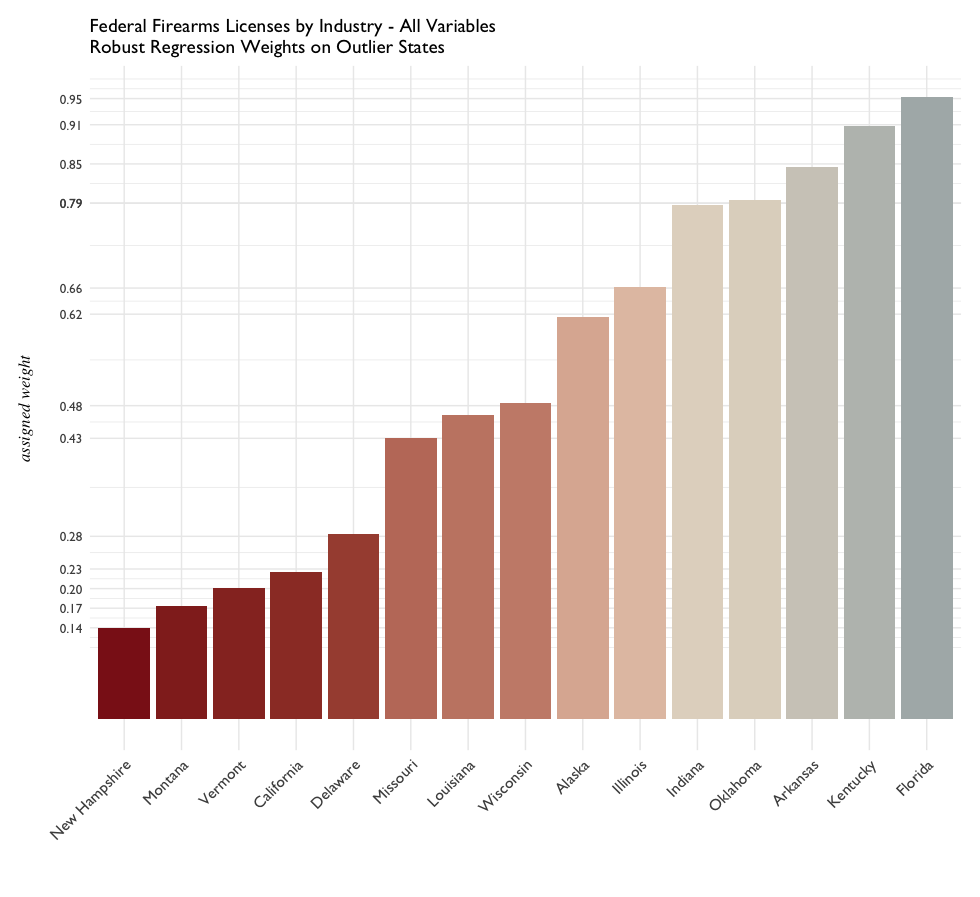

Wyoming continues to be passed on for weights. Interesting to note that the robust regression will bring outlier FFL counts down below 50 - the only two states exempt from this are North Dakota and Wyoming.

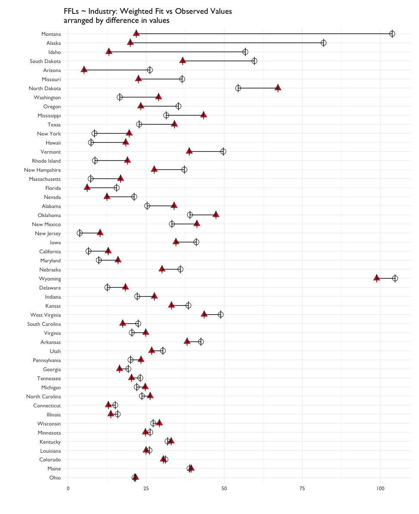

# Appendix

## Baseline Maximal Linear Model

Before fitting a robust regression on workforce variables, a baseline linear model was fit to confirm undue influence of certain states. Interestingly, more significant variables in this model by p-value are **Information**, **Wholesale.Trade**, **Real.Estate**,  and **Educational Services**. This could be due to using all variables. 

```{R}
# Baseline linear model
wf.m01 <- lm(perCapitaFFL ~ .-NAME, data = wf)
tidy(wf.m01) %>% arrange(p.value)
                          term      estimate    std.error   statistic     p.value
1                  Information  0.0404152563  0.014144685  2.85727513 0.007825685
2              Wholesale.Trade -0.0334245530  0.012584727 -2.65596169 0.012716647
3                  Real.Estate -0.0740882233  0.031695390 -2.33750785 0.026522875
4         Educational.Services -0.0137088677  0.006433380 -2.13089659 0.041702106
5               Mining.Oil.Gas  0.0101861073  0.005420855  1.87905923 0.070320782
6  Hunting.Fishing.Agriculture  0.0119235820  0.006615615  1.80233918 0.081895499
7           Arts.Entertainment -0.0174817411  0.010950517 -1.59643073 0.121233847
8                   Management  0.1707601130  0.144086148  1.18512512 0.245589144
9             Waste.Management -0.0142674215  0.012118844 -1.17729233 0.248651090
10           Finance.Insurance -0.0051153408  0.004720999 -1.08352925 0.287500370
...

glance(wf.m01) %>% select(r.squared, adj.r.squared, p.value)
  r.squared adj.r.squared      p.value
1 0.8654893     0.7727233 7.218867e-08
```

Using only variables from the 1st & 2nd `rpart` splits yields:

```{R}
wf.m01b <- lm(perCapitaFFL ~ Waste.Management + Mining.Oil.Gas, data = wf)
tidy(wf.m01b) %>% arrange(p.value)
              term    estimate   std.error statistic      p.value
1      (Intercept) 68.41786446 9.874621899  6.928657 1.048651e-08
2   Mining.Oil.Gas  0.01501871 0.003009822  4.989901 8.704357e-06
3 Waste.Management -0.03646804 0.007837704 -4.652899 2.691353e-05

glance(wf.m01b) %>% select(r.squared, adj.r.squared, p.value)
  r.squared adj.r.squared      p.value
1 0.6037577     0.5868963 3.565169e-10
```
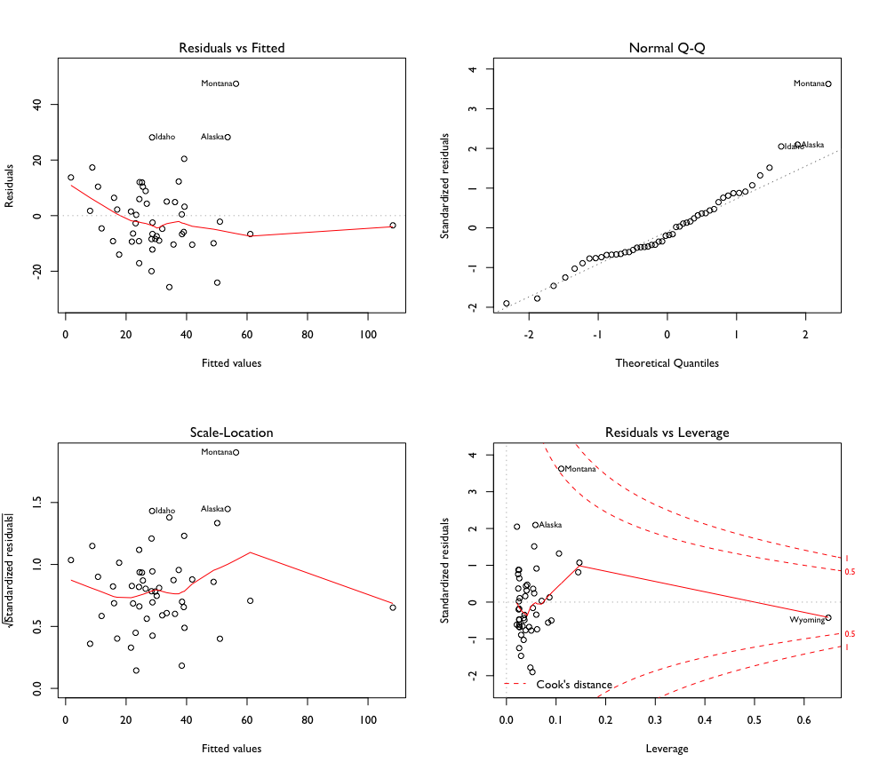

And all 4 split variables:

```{R}
wf.m01c <- lm(perCapitaFFL ~ Waste.Management + Mining.Oil.Gas + Finance.Insurance + Construction, data = wf)

tidy(wf.m01c) %>% arrange(p.value)
               term     estimate    std.error statistic      p.value
1  Waste.Management -0.038486497  0.007245811 -5.311552 3.238884e-06
2       (Intercept) 50.301366058 14.423045798  3.487569 1.100986e-03
3      Construction  0.015554030  0.005203097  2.989379 4.518500e-03
4    Mining.Oil.Gas  0.009191468  0.003362922  2.733179 8.934315e-03
5 Finance.Insurance -0.007034214  0.003599148 -1.954411 5.688325e-02

glance(wf.m01c) %>% select(r.squared, adj.r.squared, p.value)
  r.squared adj.r.squared      p.value
1 0.6783839     0.6497957 1.337578e-10
```

Using an intuitive combination of variables, based off of study of exploratory scatterplots in a shameless attempt to improve adjusted r-squared: 

```{R}
wf.m01d <- lm(perCapitaFFL ~ Waste.Management + Mining.Oil.Gas + 
                Finance.Insurance + Hunting.Fishing.Agriculture + Manufacturing, data = wf)
                
tidy(wf.m01d) %>% arrange(p.value)
                         term     estimate    std.error statistic      p.value
1                 (Intercept) 67.170936464 14.281593032  4.703322 2.551646e-05
2 Hunting.Fishing.Agriculture  0.014907841  0.003312075  4.501058 4.910752e-05
3            Waste.Management -0.025958427  0.008106679 -3.202104 2.535649e-03
4              Mining.Oil.Gas  0.009433487  0.003096187  3.046808 3.901255e-03
5           Finance.Insurance -0.006400783  0.003220379 -1.987587 5.310321e-02
6               Manufacturing -0.001615666  0.001199039 -1.347467 1.847279e-01

glance(wf.m01d) %>% select(r.squared, adj.r.squared, p.value)
  r.squared adj.r.squared     p.value
1 0.7491547     0.7206495 3.42114e-12
```

Postive, negative, positive, negative, random - FFL trends observed from exploratory scatterplots of the 5 variables in the intuitive model `wf.m01d`.

### Linear Model Comparison

```{R}
compare.lm <- bind_rows(lm01, lm02, lm03, lm04) %>%
  arrange(p.value)
  
compare.lm
  r.squared adj.r.squared      p.value model
1 0.7491547     0.7206495 3.421140e-12  lm04
2 0.6783839     0.6497957 1.337578e-10  lm03
3 0.6037577     0.5868963 3.565169e-10  lm02
4 0.8654893     0.7727233 7.218867e-08  lm01  
```

Model `wf.m01d` or `lm04` is the strongest of the group using the standard metrics of adjusted r-squared and p.value.


## Modeling Split Interactions

1st & 2nd split interactions:
```{R}
wf.m02 <- lm(perCapitaFFL ~ waste01 * mine01, data = wf)
summary(wf.m02)
Coefficients: (1 not defined because of singularities)
                       Estimate Std. Error t value Pr(>|t|)    
(Intercept)              60.798      4.551  13.358  < 2e-16 ***
waste01TRUE             -33.365      5.214  -6.399 6.68e-08 ***
mine01TRUE              -18.357      5.689  -3.227  0.00228 ** 
waste01TRUE:mine01TRUE       NA         NA      NA       NA    
---
Signif. codes:  0 ‘***’ 0.001 ‘**’ 0.01 ‘*’ 0.05 ‘.’ 0.1 ‘ ’ 1

Residual standard error: 14.39 on 47 degrees of freedom
Multiple R-squared:  0.5742,	Adjusted R-squared:  0.5561 
F-statistic: 31.69 on 2 and 47 DF,  p-value: 1.93e-09

tidy(wf.m02) %>% arrange(p.value)
         term  estimate std.error statistic      p.value
1 (Intercept)  60.79807  4.551281 13.358452 1.287485e-17
2 waste01TRUE -33.36511  5.214148 -6.398957 6.684507e-08
3  mine01TRUE -18.35705  5.689102 -3.226704 2.283033e-03

glance(wf.m02) %>% select(r.squared, adj.r.squared, p.value)
  r.squared adj.r.squared      p.value
1 0.5742294     0.5561115 1.930318e-09
```

3rd & 4th split interactions:
```{R}
# create remaining factors
fin01 <- factor(wf$Finance.Insurance >= 1368)
con01 <- factor(wf$Construction < 2399)

# model interaction 02
wf.m02b <- lm(perCapitaFFL ~ waste01 * mine01 * fin01 * con01, data = wf)
summary(wf.m02b)
Coefficients: (6 not defined because of singularities)
                                           Estimate Std. Error t value Pr(>|t|)    
(Intercept)                                 104.725     12.344   8.484 1.77e-10 ***
waste01TRUE                                 -72.205     15.118  -4.776 2.41e-05 ***
mine01TRUE                                  -22.797      9.897  -2.303 0.026529 *  
fin01TRUE                                   -45.162     13.522  -3.340 0.001823 ** 
con01TRUE                                   -52.807     14.253  -3.705 0.000639 ***
waste01TRUE:mine01TRUE                           NA         NA      NA       NA    
waste01TRUE:fin01TRUE                        43.997     16.757   2.626 0.012194 *  
mine01TRUE:fin01TRUE                             NA         NA      NA       NA    
waste01TRUE:con01TRUE                        59.337     17.601   3.371 0.001670 ** 
mine01TRUE:con01TRUE                          9.931     11.481   0.865 0.392207    
fin01TRUE:con01TRUE                          42.929     19.647   2.185 0.034800 *  
waste01TRUE:mine01TRUE:fin01TRUE                 NA         NA      NA       NA    
waste01TRUE:mine01TRUE:con01TRUE                 NA         NA      NA       NA    
waste01TRUE:fin01TRUE:con01TRUE             -58.699     22.866  -2.567 0.014104 *  
mine01TRUE:fin01TRUE:con01TRUE                   NA         NA      NA       NA    
waste01TRUE:mine01TRUE:fin01TRUE:con01TRUE       NA         NA      NA       NA    
---
Signif. codes:  0 ‘***’ 0.001 ‘**’ 0.01 ‘*’ 0.05 ‘.’ 0.1 ‘ ’ 1

Residual standard error: 12.34 on 40 degrees of freedom
Multiple R-squared:  0.7335,	Adjusted R-squared:  0.6735 
F-statistic: 12.23 on 9 and 40 DF,  p-value: 5.236e-09

tidy(wf.m02b) %>% arrange(p.value)
                              term   estimate std.error  statistic      p.value
1                      (Intercept) 104.725127 12.343567  8.4841868 1.765479e-10
2                      waste01TRUE -72.205305 15.117720 -4.7762033 2.409110e-05
3                        con01TRUE -52.806784 14.253123 -3.7049272 6.392336e-04
4            waste01TRUE:con01TRUE  59.337375 17.601309  3.3711910 1.669576e-03
5                        fin01TRUE -45.162137 13.521700 -3.3399748 1.822863e-03
6            waste01TRUE:fin01TRUE  43.996713 16.756623  2.6256312 1.219421e-02
7  waste01TRUE:fin01TRUE:con01TRUE -58.698704 22.866424 -2.5670260 1.410354e-02
8                       mine01TRUE -22.797391  9.896871 -2.3034948 2.652850e-02
9              fin01TRUE:con01TRUE  42.929403 19.646575  2.1850833 3.480007e-02
10            mine01TRUE:con01TRUE   9.930591 11.480707  0.8649808 3.922074e-01

glance(wf.m02b) %>% select(r.squared, adj.r.squared, p.value)
  r.squared adj.r.squared      p.value
1 0.7334665     0.6734964 5.236264e-09
```


# Notes

<sup>1</sup> "INDUSTRY BY SEX FOR THE FULL-TIME, YEAR-ROUND CIVILIAN EMPLOYED POPULATION 16 YEARS AND OVER", [American Community Survey](https://www.census.gov/acs/www/data/data-tables-and-tools/subject-tables/), 2015 1-Year Estimates - Subject Tables, Table S2404


